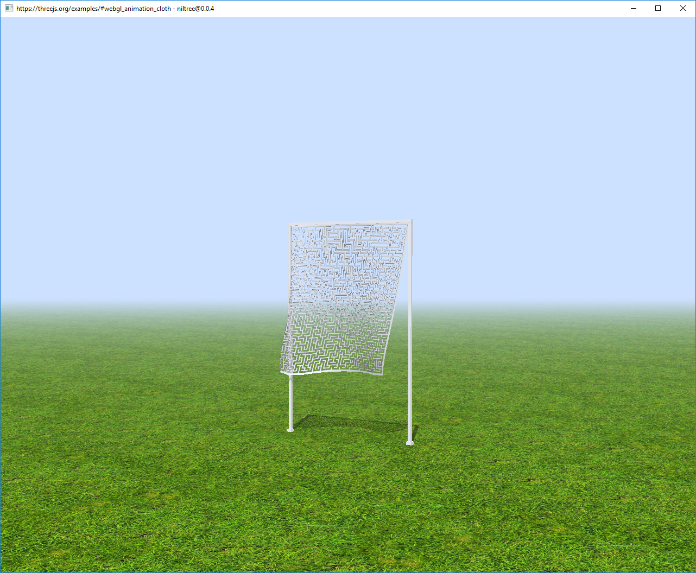

# Five Minute Guide

## Getting Started

Niltree can run any kind of WebGL website, twice as fast as Chrome. You can get this up and running in under five minutes.

This guide will show you how to install Niltree and open a WebGL site.

### Installing Niltree

* Ensure you have [Node &gt;= 9.9](https://nodejs.org/en/download/):

```text
$ node --version
v9.9.0
```


If you don't have [Node &gt;= 9.9](https://nodejs.org/en/download/), you can use [nvm](https://github.com/creationix/nvm) or [nvm-windows](https://github.com/coreybutler/nvm-windows) to install it.


* If you're on **Windows**, install [windows-build-tools](https://www.npmjs.com/package/windows-build-tools) from a Powershell Admin prompt:

```text
npm install --global --production windows-build-tools
```


Right-click on PowerShell and run "as Administrator", then paste the above command.


* Install niltree:

```
npm i -g niltree
```

### Viewing websites

Let's open a ThreeJS website in Niltree.

Go to the ThreeJS [examples](https://threejs.org/examples/) page using your web browser of choice \(Chrome, Firefox, etc\):


Most of these ThreeJS examples should run fine in Niltree. Let's try the first one, [animation/cloth](https://threejs.org/examples/#webgl_animation_cloth).  Observe that this is a WebGL site, and that it renders fine in Chrome:


Now we're going to open this same site using Niltree.

* Open your terminal \(we like [hyper](https://hyper.is/)\):


* If you're on Windows, type `niltree-win` and press enter.
* Other platforms, type `niltree`.



If you get an error about node module version, ensure `node --version` is &gt;= 9.9:

`nvm install 9.9` 

`nvm use 9.9` 

and then try again. If you still get an error, re-run

 `npm i -g niltree`


* Paste the ThreeJS URL \([https://threejs.org/examples/\#webgl\_animation\_cloth](https://threejs.org/examples/#webgl_animation_cloth)\) and press enter.

Niltree will open and run the site:




Let's navigate to a different site.

* Pick out a different ThreeJS [example ](https://threejs.org/examples/)that you like:


* Switch back to Niltree's command prompt and paste the URL \(e.g. [https://threejs.org/examples/\#webgl\_geometry\_minecraft](https://threejs.org/examples/#webgl_geometry_minecraft)\):


### Niltree's command prompt

The niltree command prompt is a NodeJS REPL. If you're a node developer, the interface should be quite familiar. Open niltree and run `.help`:



 Pressing up and down will scroll through your REPL history.



Under the hood, pasting a URL is shorthand for typing `.go <url>`.


Similar to Chrome's devtools, you can evaluate any expression you want in the context of the current website. Navigate somewhere and type `window.location`:


This covers the basics of using Niltree.

